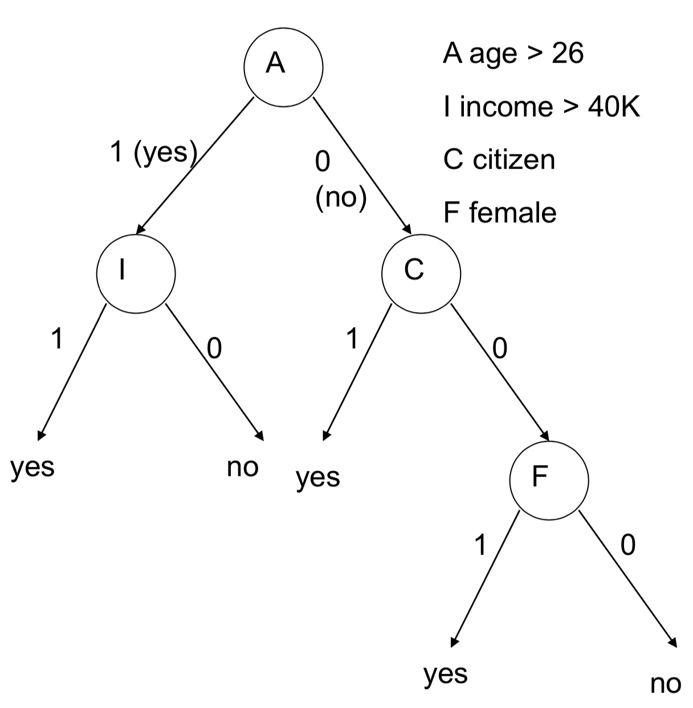

# Parallel Streaming Decision Tree on GPU

<center> ke Ding(dekin) || Anxiang Zhang (anxiangz@andrew.cmu.edu) </center>

## URL
https://linna1998.github.io/Parallel-Decision-Tree-on-GPU/

## Summary
We are going to implement a streaming and communication-efficient parallel version of the gradient boosting decision tree (gbdt). Streaming means that the model could use online training method and be capable of processing streaming data like batch data in neural network training. At first, we are going to implement a sequential version and use CPU to parallelize it. This model is served as a baseline. Then, GPU would be applied to implement a faster version. Finally, we are going to evaluate the speedup, memory performance and bottlenecks of all these versions. The main challenge resides in which strategy we would use to parallelize the algorithm. There are multiple ways to parallel the decision tree building process, including data-parallel, feature-parallel, etc. Some strategies are easy to implement but suffer from the load-balance issue. Some strategies have high communication costs. In our study, we focus on reducing communication costs during the tree construction process. Also, memory constraint would be taken into consideration since GPU has limited memory to use. 

## Background

### What is decision tree?

Decision Tree is a classic classification model in machine learning. It's famous for its simplicity, interpretability and effectiveness. A naive implementation fo decision tree is following
```
Function BuildTree(n,A) // n: samples (rows), A: attributes 
    If empty(A) or all n(L) are the same
        status = leaf
        class = most common class in n(L) 
    else
        status = internal
        a <- bestAttributeSplitPoint(n,A)
        LeftNode = BuildTree(n(a=1), A \ {a}) RightNode = BuildTree(n(a=0), A \ {a})
    end 
end
```
<!--  -->

Decision tree ensemble algorithms are increasingly adopted as a crucial solution to modern machine learning applications such as classification. The major computation cost of the training decision tree ensemble comes from training a single decision tree, and the key challenge of decision tree building process is the high cost in finding the best split for each leaf(`bestAttributeSplitPoint(n ,A) in the algorithm`), which requires scanning through all the training data and all the features in the current sub-tree (O(#features * #data)).[3]

### Different parallel approaches of decision tree

1. CPU Parallel:
There are multiple ways to parallel the decision tree building process. More specifically, there are mainly two methods

- Task Parallel
Classification decision tree construction algorithms have natural concurrency, as once a node is generated, all of its children in the classification tree can be generated concurrently. But this method suffers from *major load imbalance* issue and *high communication cost*. So we would not use this kind of parallel strategy.[1]

- Feature Parallel (Vertical Parallel)
When splitting the node, each feature data would be processed independently to find the best split point. Then each process would communicate to get the optimal splitting the data. Afterward, one processor would partition the data based on the splitting point and then broadcast the data to other processors. This result addresses the load balance issue, but suffer from high communication cost when the data set is large. Which means this staregy does not suit for GPU parallelism. [2]

- Data-Parallel (Horizontal Parallel)
Data parallel partitions the dataset so that each processor could handle only a portion of the dataset. Each process builds the histogram of all the features and then merge the histogram by communication. So the method reduces communication cost very much and also support streaming data. So this method is suitable for GPU because GPU has limited share memory to use. [2]


2. GPU Parallel:
Much existing publication focus on building communication-efficient and scalable distributed decision tree, while there is a limited exploration in GPU accelerations. On the one hand, GPU’s strict memory constraint this method does not scale to a large dataset. On the other hand, GPU used SIMD instructions within a warp and thus instruction divergence is a big problem in GPU programming. [3]

## Challenge
- How to parallelize so that the model could be capable of handling streaming data. (Data-parallel is a possible way)

- How to parallelize in GPU given that GPU has a limited memory size. (<= 64 KB while the dataset could be million)

- How to maintain a good workload balance.

- How to achieve low communication cost as data set becomes larger (still scale as data size becomes larger).

## Resources

### Codes
1. XGBoost: https://github.com/dmlc/xgboost
2. LightGBM: https://github.com/microsoft/LightGBM
3. thunderGBM: https://github.com/Xtra-Computing/thundergbm/tree/master/src/thundergbm
4. https://lightgbm.readthedocs.io/en/latest/Features.html#optimization-in-parallel-learning

### Papers
1. thunderGBM: Exploiting GPUs for Efficient Gradient Boosting Decision Tree Training
2. XGBoost: Scalable GPU Accelerated Learning
3. Accelerating the XGBoost algorithm using GPU computing
4. Exploiting GPUs for Efficient Gradient Boosting Decision Tree Training
5. Communication-Efficient Parallel Algorithm for Decision Tree

## Goals and deliverables

1. Implement a basic sequential code for decision tree algorithm
2. Implement data-parallel code on CPU for decision tree algorithm based on the sequential code. 
3. Implement basic parallel code on GPU based on the previous results
4. Improve our GPU parallel version with some new algorithms

### Hope to achieve:
1. High scalability on GPU when data becomes larger
2. More speedup on GPU.

### Demo and poster
1. Evaluate sequential, data-parallel CPU, basic GPU, advanced GPU versions.
2. Compare the memory usage of different versions.
3. Compare the feature and data samples, find the limitations of the parallel scheme.
4. Give in what situations, CUDA version can achieve high speedup.

## Platform:
1. Platform: parallel system: GHC, latedays
2. Language: mainly C/C++, CUDA

## Schedule:
10.30 Finish proposal and website.

11.6 Finish the sequential version. Find the dataset for evaluation.

11.13 Finish the CPU data parallel version.

11.22 Project Milestone. Finish basic GPU parallel version.

11.27 Improve GPU parallel version.

12.4 Evaluate and find the trade-offs between different implementations.

12.10 Finish final report and poster.


## References

[1]: Srivastava, Anurag, et al. "Parallel formulations of decision-tree classification algorithms." High Performance Data Mining. Springer, Boston, MA, 1999. 237-261.

[2]: Ben-Haim, Yael, and Elad Tom-Tov. "A streaming parallel decision tree algorithm." Journal of Machine Learning Research 11.Feb (2010): 849-872.

[3]: Zhang, Huan, Si Si, and Cho-Jui Hsieh. "GPU-acceleration for Large-scale Tree Boosting." arXiv preprint arXiv:1706.08359 (2017).

[4]: Jin, Ruoming, and Gagan Agrawal. "Communication and memory efficient parallel decision tree construction." Proceedings of the 2003 SIAM International Conference on Data Mining. Society for Industrial and Applied Mathematics, 2003.