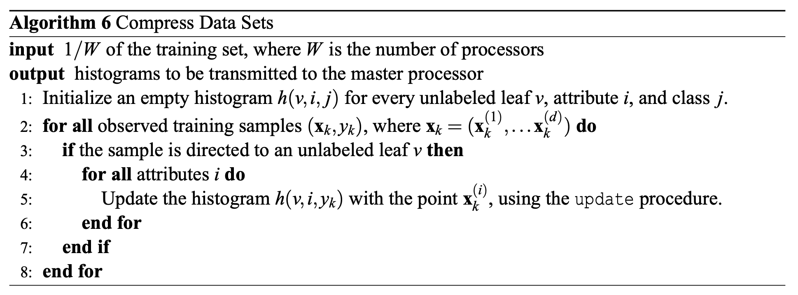
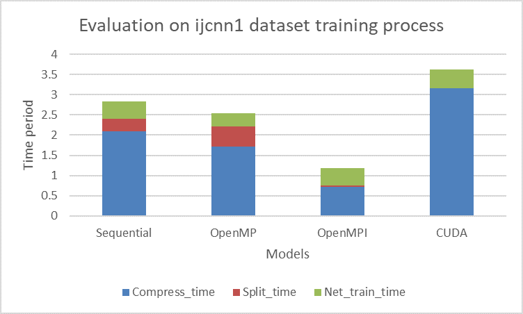
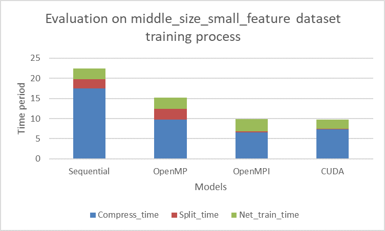
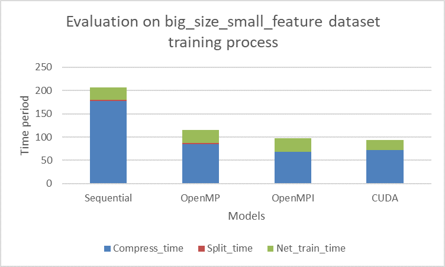
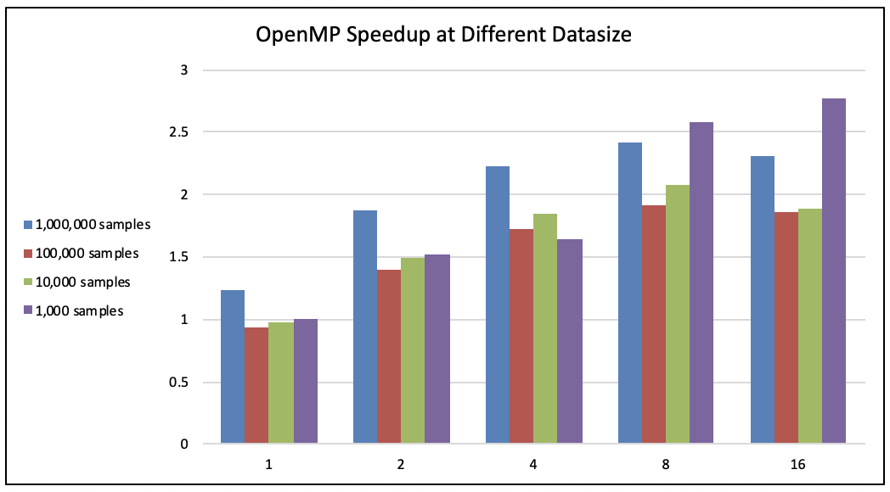
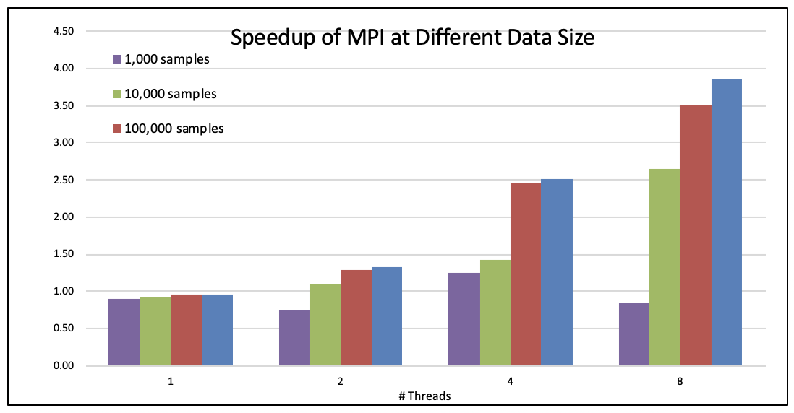
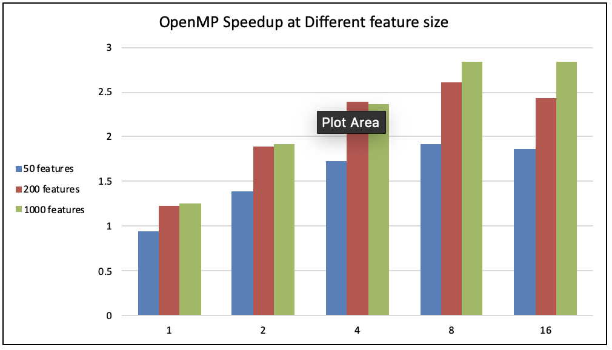
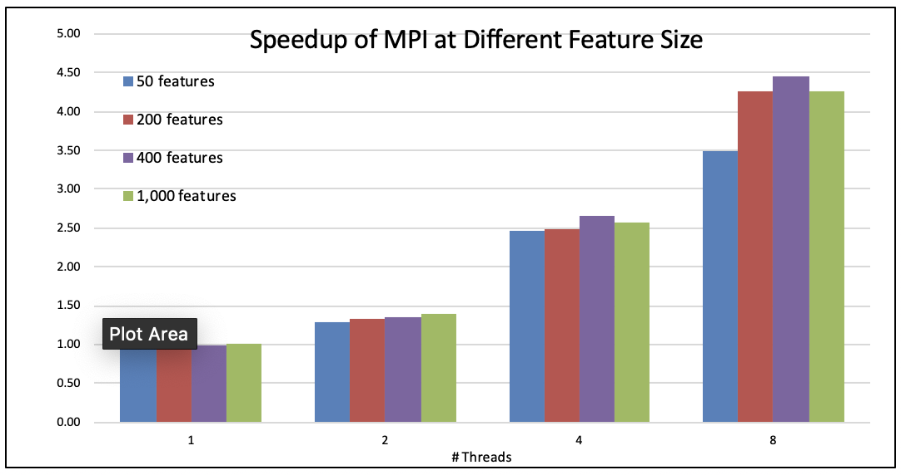

# Parallel Streaming Decision Tree - Final Report
<center> ke Ding(keding@andrew.cmu.edu) || Anxiang Zhang (anxiangz@andrew.cmu.edu) </center>

## Summary
We implemented the sequential version, the OpenMP version, the OpenMPI version and the CUDA version for decision tree with histogram and compared the performance of four implementations.

## Takeaways
The OpenMPI and CUDA version of decision tree could gain promising speedup in CPU and GPU parallel, separately.


## Backgrounds

### Decisiton Tree
Decision Tree is widely used in Machine learning and it is simple and intuitive.

Traditionally, a decision tree is built in the following way.
```pseudocode
Function BuildTree(n,A) // n: samples (rows), A: attributes 
    If empty(A) or all n(L) are the same
        status = leaf
        class = most common class in n(L) 
    else
        status = internal
        a <- bestAttributeSplitPoint(n,A)
        LeftNode = BuildTree(n(a=1), A \ {a}) RightNode = BuildTree(n(a=0), A \ {a})
    end 
end

```

However, this approach is expensive in finding the `bestAttributeSplitPoint(n,A) `because it needs to iterate all the data set to find the best split for one feature. So this would lead to a $O(data*feature)$ complexity. One approach introduced by  [A Streaming Parallel Decision Tree Algorithm](http://www.jmlr.org/papers/volume11/ben-haim10a/ben-haim10a.pdf )  is to use an approaximation algorith. Firstly, we compress the data into pre-defined number of bins and then we iterate each bin for one feature, which reduce the complexity to $O(bins*feature)$. 

```pseudocode
Call TreeBuilding procedure:
Initialize T to be a single unlabeled node.
foreach batch_data do:
	Reinitialize every leaf in T as unlabeled.
  while there are unlabeled leaves in T:
    Navigate the batch_data to the leaves
    Construct the histogram h(v, i, c) by calling COMPRESS procedure.
    for all unlabeled leaves v in T do:
      if v.should_terminate() or there are no samples reaching v:
        Label v
      else:
        Call find_best_split procedures:
          for all features i do:
            Merge the h(v, i, 1)..h(v, i, c) and get h(v, i)
            Determine the candidate splits by calling UNIFORM.
            Estimate the information gain of each candidata by calling SUM.
          endfor
        Split v with the highest gain.
      endif
    endfor
  endwhile
```

In this approaximation algorithm, the computational cost is amortized from one function (`find_best_split`) to two functions(`find_best_split` & `compress`). So our goal is to parallelize these two functions.

### Key Data Structures

#### How we store our dataset in vector version
We use the class `Dataset` in /src/SPDT\_general/parser.cpp to store the dataset. For each data, we use the class `Data` in the same file to store it. The `Data` class contains an int `label` to mark the label of the data, and an unordered\_map `values` to store the map between feature id and feature values. Some datasets contain sparse features, therefore we are using a map to store all and ignore the other 0's. 

The class `Dataset` contains a vector of `Data`, to store all the possible datas. It also stores some other dataset parameters, such as the number of features, the number of data.

#### How we store our dataset in several serialized arrays for GPU
When we pass dataset to GPU, the above vector version for dataset storage is not possible here. Therefore, we come up with a new version to store the dataset: several 1-D arrays.

We are storing our dataset into two 1-D arrays. The pointer label\_ptr points to an array of integers. The pointer value\_ptr points to an array of floats. Due to the fact that it's better to pre-malloc place for the whole dataset, we are storing features and values in the dense mode. The size of the label\_ptr is num\_of\_data. The size of the value\_ptr is num\_of\_data * num\_of\_features. If we want to read/write to the (data\_id, feature\_id), then its label is label\_ptr[data\_id], and its value is value\_ptr[data\_id * number\_of\_features + feature\_id].

The limitation of serialized arrays dataset are that, it's difficult to manage this dataset and provide operations. It's hard to write codes and debug. The memory usage of this version is large. While the memory on GPU is limited, it's difficult for some dataset to run in GPU parallel version.

#### How we serialize histograms
We are serialize histograms in a huge 1-D array. 

For each histogram, we store it into a float array. The first element is the size of the histogram bins. After that, we store the (freq, value) of each element in the histogram. According to these rules, the histogram could be changed into an 1-D array. In order to malloc the place of all histograms together, for each histogram we initially malloc the place for the max_bin_size. We provide some setter and getter functions for histogram related operations. 


### Key Operations

#### Several operations for histograms
The operations for histograms are: update, sum, merge, uniform, compress. The update function updates a value to a histogram. The sum function calculates the estimated sum distribution for values in a specific range. The merge function merges two histograms. If possible, it would merge the bins in the histogram to fit the max bin size. The uniform function provides possible split values for a histogram. The compress function builds the histogram from a series of data.


### Algorithm's inputs and outputs
The input of algorithm includes the train dataset and the test dataset. It also includes some parameters of the dataset, including the number of data, the number of features, the number of classes and so on.

The output of the algorithm is a decision tree. We could use the decision tree to predict the labels of the test dataset, so as to verify the correctness of decision tree.

### Computationally expensive parts

#### compress function



#### Get gain function
This function calcualtes the gain of a specific split feature and split value for the node.It includes many float operations. It also calls functions such as SUM in histogram.


### Key Challenges
* Dependency Analysis: Histogram is a global variable that we need to protect. If we use shared-memory model, then we need to manually synchronize for the `update` operation to the same `h(v, i, j)`. Similarly, in the `find_best_split` operation, a `best_split` is shared and thus needed to be serialized.

* Memory Latency: Since the data is disk-residency, the memory latency is large. We have the leverage the temporal locality. 

## Approach
There are mainly two functions in the tree building process that are costly. `compress` function and `find_best_split` function. And both of them could be parallelized. Since now to do not need to Also, we introduce our baseline parallel strategy ---- Node Parallel. 

### Node Parallel

This parallel method is the most intuitive method because there is a natural independent loop in the psedocode,`for all unlabeled leaves v in T do`. However, this work partitioning strategy suffers from one problem, namely,  **imbalanced Workload** : The workload is determined by the number of childs of this parent node. However, this is unpredictable. Due to the essential drawback of static assignment of this parallel paradigm, the workload is unbalanced so this strategy is expected to show worst speedup and bad scalability.

### Feature Parallel

In the `find_best_split` procedure, the `for all features i do` loop could be parallelized. One note is that the best split information should be manurally syncronized. One method is to introduce a local varaible for each worker and then merge the results afterwards. Another method is to use lock-based syncronization to protect the shared varaible. After testing, we implemented the first version. Since each thread only needs to send it's best split feature to the master, the communication  cost is O(P)

### Data Parallel

In the `compress` procedure, the `foreach data point (x, y) do` is parallelized. But similarly to the feature parallel version, there is a big challenge. Each data point would update `h(v, i, y)`, which means there is huge contension for the histogram method. In order to encounter this problem, we reorder the loop in a way that there is no race condition. 

```pseudocode
Call COMPRESS procedure:
	Initalized empty histogram h(v, i, j) for unlabeled leaf v, feature i, class j
	#pragma omp parallel for
	foreach unlabeled leaf v do:
		foreach data point (x, y) in v do:
			foreach feature i do:
				Call UPDATE procefure to update h(v, i, y)
			endfor
		endif
	endfor
```

This strategy is used by using shared-memory model and implemente by OpenMP. However, this algorithm would suffer from some trivial work imbalance problem as each leaf contains unequal number of data points. But this could be matigated by dynamic scheduling.


We also introduce a message-passing model data-parallel version here. This strategy is essentially streaming and could handle as much as possible. This parallel algorithm is borrowed from [A Streaming Parallel Decision Tree Algorithm](http://www.jmlr.org/papers/volume11/ben-haim10a/ben-haim10a.pdf ).


This algorithm is essentially streaming and need explicit synchronization. After each work completes their work, all the histogram data would be transferred to the MASTER worker and do the merging process. After mergin completes, the result would be braodcasted to other workers. (For more information about merging and some convergence proof, please refer to the paper.) Since each worker would send the histogram to the MASTER, the communication cost is $O( W ×L×c×d)$, where $W$ is the number of workers, $L$ is the number of unlabeled leaves in the current iteration, $c$ is the number of labels and $d$ is the number of features.  For a summary for this algorithm,

- At most$ N/W$ operations by each processor in the updating phase.
- $O( W ×L×c×d)$ communication cost.
- $O( W ×L×c×d)$ for merging.

### Data-Feature Parallel

We successfully combined the above two parallel strategy together as they should be independent with each other.

## Implementation

### OpenMP & OpenMPI implementations
All the parallel approaches are implemented by OpenMP and also we did a message-passing  Data-Feature parallel version on OpenMPI. 

#### CUDA implementation
Further more, we implemented a parallel version on CUDA. The codes could be seen in the /src/SPDT_CUDA folder.

We introduced four kernels to provide parallel to CUDA: histogram_update_kernel, calculate_feature_value_kernel, calculate_gain_deltas_kernel, navigate_sample_kernel.

`Histogram_update_kernel` is the kernel which updates the histogram with the given (key, value) pair. It is used in the `compress` function. There are two versions on this kernel. The first version is implemented in data parallel. The block number is the number of data, the thread number is the number of features. For each thread, it uses the corresponding feature value in the corresponding data to update the histogram. Even though this version could achieve high distribution works, we found out that there is competition for different threads to update the same histogram in the system, causing the wrong result. While the paper [Implementing Streaming Parallel Decision Trees on Graphic Processing Units](http://www.diva-portal.org/smash/record.jsf?pid=diva2%3A1220512&dswid=-9029) believes the conflict of updating the same histogram effects little to the correctness, we decide to assign the tasks differently.

We decide to set the block number to be the number of unlabeled leaves, and the thread number to be the number of features. Each thread would go through the dataset, and update its own histogram according to the data. Therefore, we are parallel over different histograms. Even though there is fewer parallelism here, our apporach is guaranteed to have no data update conflict.

`calculate_feature_value_kernel` is the kernel to calculate the promising split points features and values for the splitting operation for a leave node. It mainly calls the `CUDA_merge_array_pointers` and `CUDA_uniform_array` functions. It first merges the two possible histograms with the `CUDA_merge_array_pointers` function, then calls the `CUDA_uniform_array` function to uniform the array and come up with possible split points. We set the thread number to be 128, and block number being (num_of_features + thread_num - 1) / thread_num. In other words, we are paralleling over different features for the leave node. The total thread number equals to the number of features. For each thread, we come up with possible split (feature, value) pairs and store the result to an array.

`calculate_gain_deltas_kernel` calculates the gain and entropy for each promising split point. According to the `calculate_feature_value_kernel` step, for each feature, there is at most `max_bin_size` number of possible split values. Therefore, the block number equals to the feature number, and the thread number equals to the max bin size parameter for histograms.

`navigate_sample_kernel` assigns the datas to the leave nodes. It is parallel over different data points. The thread number is 128. The block number is (num\_of\_data + thread\_num - 1) / thread\_num. Therefore, the total thread number equals to the number of data. For each thread, it checks the assignment of a data pointer in the dataset. This function is called every time initialize a level of unlabeled leaves of histograms.

We also introduced some helper functions and files to achieve the CUDA implementation. Basically, we have re-write other functions in array and pointers. In the CUDA version, data is at most serialized and stored in some 1-D arrays. Moreover, there is no STL vectors allowed in the CUDA kernel codes. Therefore, we have designed specific data structures and algorithms to support the CUDA version.


## Results

### General speed-up figure

In the general evaluation process, we choose three datasets: ijcnn1, big_size_small_feature and middle_size_small_feature as samples to evaluate the speedup of them. The dataset ijcnn1 is taken from [LIBSVM dataset](https://www.csie.ntu.edu.tw/~cjlin/libsvmtools/datasets/) [5]. The feature size is 22. It contains 49990 train data and 91701 test data.

We generated the other two test cases by our scripts. The dataset big_size_small_feature contains 1,000,000 train cases and 100,000 test cases. The feature size is 50. The dataset middle_size_small_feature contains 100,000 train cases and 10,000 test cases. The feature size is 50. We want to evaluate the scalability of different parallel algorithms, therefore we generate these datasets by ourselves.

We compared our four approaches: the sequential version, the OpenMP version (thread number = 4), the OpenMPI version (thread number = 4) and the CUDA version. Our baseline is the single-threaded CPU sequential code.

The speedup for four versions could be seen in figures 






### Node Parallel & Data-Feature Parallel Speedup analysis 


As we expecetd, the node parallel version suffered from tremendous workload imbalance problem. As we shown here, the program shows little scalability.

### Data-Feature Parallel Scalability over Data Size

<!--   -->
<p float="right">
  
   
   
</p>

From the above figures, we could see the influence of computation cost and locality. When the sample size is 1000 and we are using 16 threads, we could assume that the data size assigned to each thread is small. Therefore, the data might fit into the cache of the processor. According to the locality, we could achieve higher speedup for the 1000 samples under 16 and 8 threads in OpenMP implementation. When we talk about the computation cost, we could say that a larger dataset includes more computation cost. Therefore, if we increase the size of the dataset, then we could achieve higher speedup in OpenMP and OpenMPI versions.

### Data-Feature Parallel Scalability over Feature Size

<p float="right">
  
   
   
</p>
Shared address model shows better scalability over feature size than message passing. This is because the major computation cost is from `compress` and the workload for each worker for one iteration in `compress` is $O(#data/#workers * #feature)$. So as feature size increases, the program becomes more computational-intensive.

However, message passing version shows less scalability as feature size increases from 400 to 1000. This is because that that in `compress` function, the master worker is responsible for merging all the results and thus the computational cost is $O(#feature * #bin)$ and also the communication cost is linearly related to feature size. So even though the increase of feature size leads to higher computational cost, it also increase the non-paralliazable computation in MASTER and communication cost. So the scalability over feature size shows a non-linear relation.

### CUDA Speedup Analysis
From the previous figures we can see, the CUDA version is slower than the sequential version in the ijcnn1 dataset. When the size of training dataset began to scale, the CUDA version achieves higher speedup. 

When it comes to the largest big_size_small_feature dataset, the CUDA version achieves the highest speedup. However, the speedup of CUDA is sightly lower than our expectation. The possible reasons might be as follows.

1. The data transfer time for cudaMalloc and cudaMemcpy. In the CUDA version, we have to transfer the result between CUDA device and the host. The data transfer time for ijcnn1 dataset is 0.111410 seconds. While the total train time is 3.152414 seconds, the data transfer time occupies 3.53% of the total train time. Therefore, it might lead to a slightly poor performance for the CUDA version. The data transfer time for medium_size_small_feature dataset is 0.108330 (1.11%) and the data transfer time for big_size_small_feature dataset is 0.121970 seconds (0.13%). Therefore, when the dataset began to expand, the influence of data transfer reduces.
2. The inherent operations in CUDA version. When we change from the sequential version to the CUDA version, we have included other operations so as to support the CUDA version. For example, in the `calculate_feature_value_kernel` fucntion, we have a new data structure `cuda_feature_value_num` to record the possible split value numbers for each feature. We have to calcualte this data structure explicitly. While in the previous versions, there is no need to build this data structure explicitly. The CUDA version creates new calculations.


## References

[1]: Srivastava, Anurag, et al. "Parallel formulations of decision-tree classification algorithms." High Performance Data Mining. Springer, Boston, MA, 1999. 237-261.

[2]: Ben-Haim, Yael, and Elad Tom-Tov. "A streaming parallel decision tree algorithm." Journal of Machine Learning Research 11.Feb (2010): 849-872.

[3]: Zhang, Huan, Si Si, and Cho-Jui Hsieh. "GPU-acceleration for Large-scale Tree Boosting." arXiv preprint arXiv:1706.08359 (2017).

[4]: Jin, Ruoming, and Gagan Agrawal. "Communication and memory efficient parallel decision tree construction." Proceedings of the 2003 SIAM International Conference on Data Mining. Society for Industrial and Applied Mathematics, 2003.

[5]: Chih-Chung Chang and Chih-Jen Lin, LIBSVM : a library for support vector machines. ACM Transactions on Intelligent Systems and Technology, 2:27:1--27:27, 2011. Software available at http://www.csie.ntu.edu.tw/~cjlin/libsvm.

## List of work

